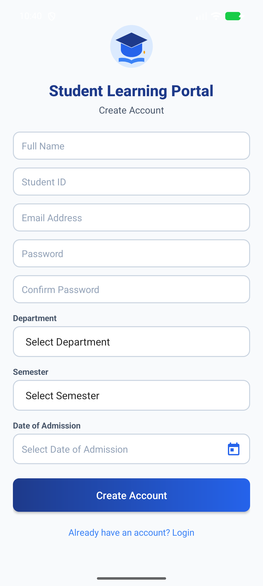
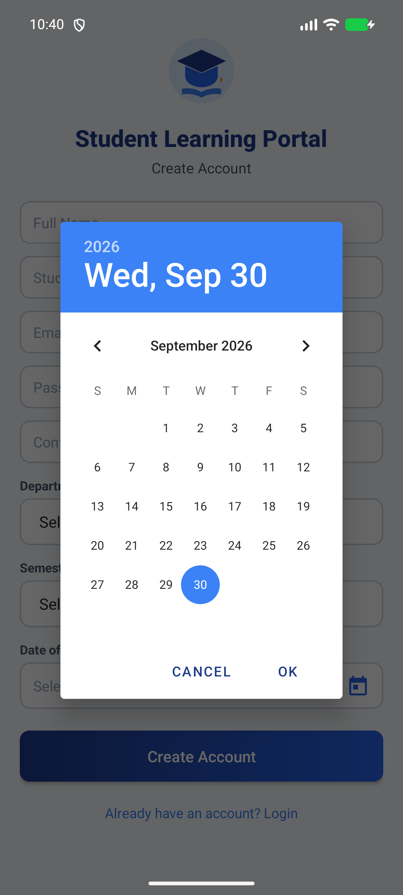
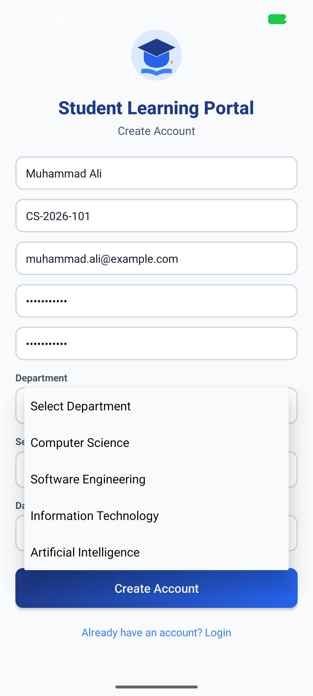
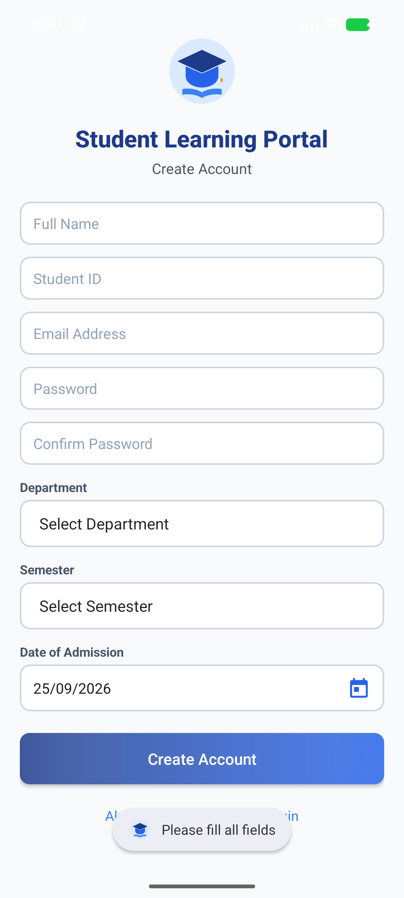
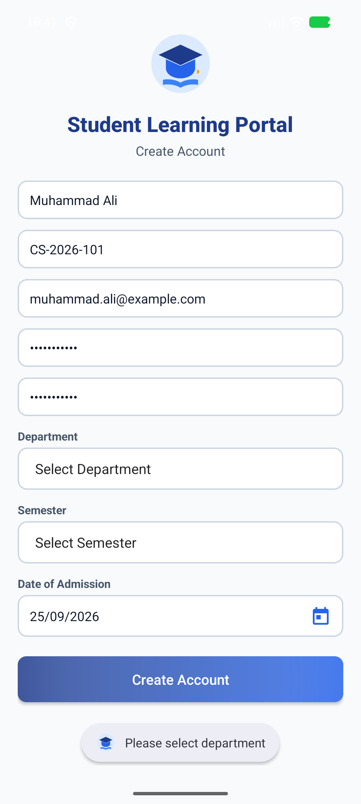
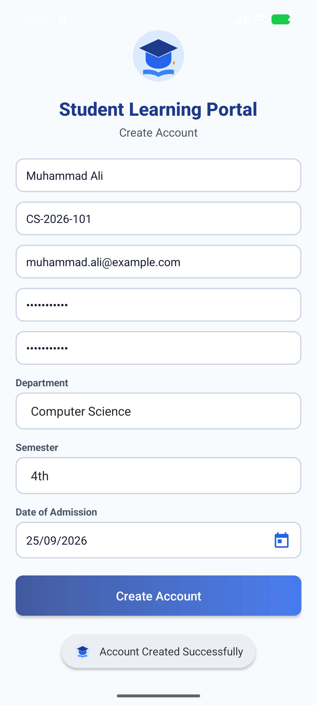
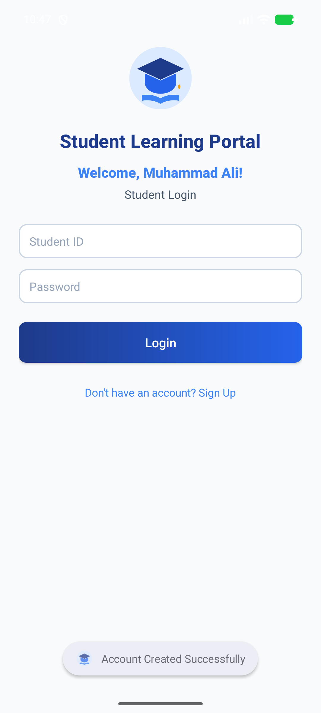
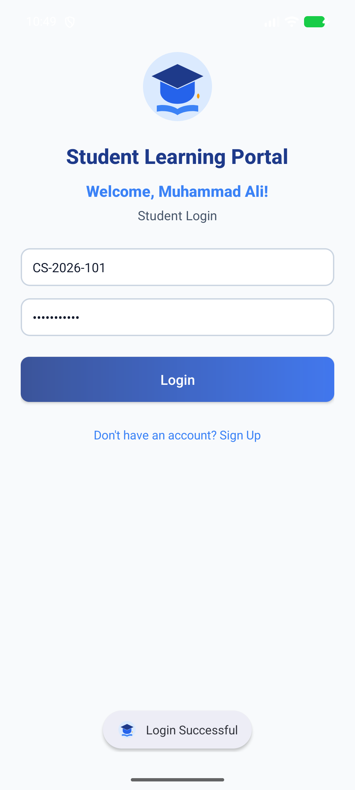

# Student Learning Portal 🎓

An Android application built using **Kotlin** for the **Student Learning Portal** assignment. It demonstrates standard Android layout paradigms, form handling, DatePickerDialog integration, dropdown spinners, input validation with feedback toasts, and inter-activity communication using **Intents**.

---

## 📱 Project Architecture & Activities

### Screen 1 — Create Account (`CreateAccountActivity`)
- **Layout Architecture**: Built using **`RelativeLayout`** (`activity_create_account.xml`) wrapped in a responsive viewport for clean display across all screen sizes.
- **Included Elements**:
  1. **Title**: "Student Learning Portal"
  2. **Image**: Custom educational graduation emblem vector drawable (`@drawable/ic_student_portal`)
  3. **Full Name**: User input (`inputType="textPersonName"`)
  4. **Student ID**: User input (`inputType="text"`)
  5. **Email Address**: User input (`inputType="textEmailAddress"`)
  6. **Password**: User input (`inputType="textPassword"`)
  7. **Confirm Password**: User input (`inputType="textPassword"`)
  8. **Department Dropdown (Spinner)**:
     - `Select Department` *(Default prompt)*
     - `Computer Science`
     - `Software Engineering`
     - `Information Technology`
     - `Artificial Intelligence`
  9. **Semester Dropdown (Spinner)**:
     - `Select Semester` *(Default prompt)*
     - `1st`, `2nd`, `3rd`, `4th`, `5th`, `6th`, `7th`, `8th`
  10. **Date of Admission**: Interactive calendar picker using `DatePickerDialog`
  11. **Create Account Button**: Validates inputs and triggers navigation
  12. **Quick Login Link**: For existing students to jump to the Login screen

#### 🛡️ Screen 1 Validation Rules Implemented:
1. **Empty fields** $\rightarrow$ `Toast: "Please fill all fields"`
2. **Department not selected (index 0)** $\rightarrow$ `Toast: "Please select department"`
3. **Semester not selected (index 0)** $\rightarrow$ `Toast: "Please select semester"`
4. **Password & Confirm Password mismatch** $\rightarrow$ `Toast: "Passwords do not match"`
5. **Successful signup** $\rightarrow$ `Toast: "Account Created Successfully"`
6. **Navigation**: Launches `LoginActivity` passing the student's full name via `Intent.putExtra("extra_student_name", fullName)`.

---

### Screen 2 — Login (`LoginActivity`)
- **Layout Architecture**: Built completely from scratch using **`LinearLayout`** (`activity_login.xml`) with vertical orientation (`android:orientation="vertical"`).
- **Included Elements**:
  1. **App Title**: "Student Learning Portal"
  2. **Personalized Welcome Message**: Dynamically receives the student's name from `CreateAccountActivity` via `Intent` and displays `Welcome, <Student Name>!` (e.g., `Welcome, Muhammad Ali!`)
  3. **Student ID field**: User input
  4. **Password field**: User input (`inputType="textPassword"`)
  5. **Login Button**: Triggers credential validation
  6. **Back to Sign Up Link**: Allows seamless switching back to the registration screen

#### 🔑 Screen 2 Login Functionality Implemented:
- **Empty Credentials**: If Student ID or Password is empty $\rightarrow$ `Toast: "Please enter Student ID and Password"`
- **Filled Credentials**: If both are entered $\rightarrow$ `Toast: "Login Successful"`

---

## 📸 Screenshots & Verification

| Screen 1: Create Account (`RelativeLayout`) | DatePickerDialog Calendar | Department Dropdown |
| :---: | :---: | :---: |
|  |  |  |

| Validation: Empty Fields | Validation: Department Required | Validation: Passwords Mismatch |
| :---: | :---: | :---: |
|  |  |  |

| Successful Signup & Toast | Screen 2: Login (`LinearLayout`) | Login Success Toast |
| :---: | :---: | :---: |
|  |  |  |

---

## 🛠️ Project Structure

```
Assignement/
├── Student_Learning_Portal.apk            # Pre-compiled, installable Debug APK
├── app/
│   ├── src/main/
│   │   ├── AndroidManifest.xml            # Activity declarations and launcher filter
│   │   ├── java/com/example/studentlearningportal/
│   │   │   ├── CreateAccountActivity.kt   # Screen 1 (RelativeLayout & Validations)
│   │   │   └── LoginActivity.kt           # Screen 2 (LinearLayout & Intent Handler)
│   │   └── res/
│   │       ├── drawable/
│   │       │   ├── ic_student_portal.xml  # Education Portal Vector Emblem
│   │       │   ├── ic_calendar.xml        # Calendar Vector Icon
│   │       │   ├── edit_text_bg.xml       # Rounded field styling
│   │       │   ├── spinner_bg.xml         # Dropdown selector styling
│   │       │   └── button_primary_bg.xml  # Button ripple background
│   │       ├── layout/
│   │       │   ├── activity_create_account.xml  # Screen 1 (RelativeLayout)
│   │       │   └── activity_login.xml           # Screen 2 (LinearLayout)
│   │       └── values/
│   │           ├── colors.xml             # Blue/indigo modern color scheme
│   │           ├── strings.xml            # All strings, labels, arrays & messages
│   │           └── themes.xml             # Clean MaterialComponents theme
│   └── build.gradle.kts                   # Module build configuration
├── gradle/
│   ├── libs.versions.toml                 # Version catalog
│   └── wrapper/                           # Gradle 9.4.1 wrapper
├── settings.gradle.kts                    # Root project configuration
├── build.gradle.kts                       # Top-level build file
└── README.md                              # Complete assignment documentation
```

---

## 🚀 How to Run

### Method 1: Direct APK Installation
A ready-to-test APK is provided at the root of the project:
```bash
adb install -r Student_Learning_Portal.apk
```

### Method 2: Open in Android Studio
1. Open **Android Studio**.
2. Select **Open** and navigate to `e:\Coding projects\Assignement`.
3. Let Gradle sync and select `app` from the run configuration.
4. Click **Run ▶** (or press `Shift + F10`) to deploy to your emulator or physical Android device.
